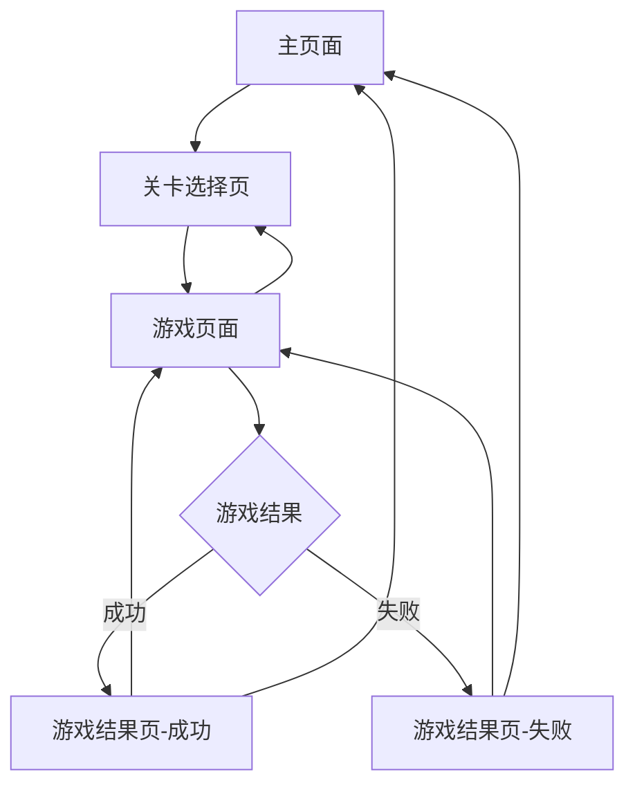

## 1. 产品概述
疯狂的鸽子是一款休闲街机类小游戏，玩法类似《飞刀挑战》但采用鸽子主题。玩家控制鸽子向旋转的向日葵靶心投掷玉米粒，在避免碰撞已投掷物品的同时完成关卡目标。

目标用户为喜欢休闲游戏的移动端用户，通过简单有趣的核心循环和渐进式难度设计，为用户提供轻松愉快的游戏体验。

## 2. 核心功能

### 2.1 用户角色
本游戏为单机游戏，无需用户注册登录系统。

### 2.2 功能模块
疯狂的鸽子游戏包含以下核心页面：
1. **主页面**：游戏标题、鸽子角色展示、开始游戏按钮、设置和商店入口
2. **关卡选择页**：关卡网格展示、锁定/解锁状态、星级评分、难度分类
3. **游戏页面**：游戏画布、暂停按钮、剩余弹药显示、星级进度、关卡编号
4. **游戏结果页**：成功/失败提示、星级评分、重新开始和返回主页按钮

### 2.3 页面详情
| 页面名称 | 模块名称 | 功能描述 |
|---------|---------|---------|
| 主页面 | 游戏标题区 | 显示游戏名称"疯狂的鸽子"，背景包含鸽子角色插画 |
| 主页面 | 开始游戏按钮 | 绿色圆形按钮，点击跳转到关卡选择页面 |
| 主页面 | 功能入口 | 设置按钮（齿轮图标）、礼物按钮（礼物盒图标）、应用网格按钮 |
| 关卡选择页 | 关卡网格 | 4x4网格布局，显示关卡编号、星级评分、锁定状态 |
| 关卡选择页 | 难度分类 | "简单"、"普通"、"困难"等分类标签，带波浪形边框设计 |
| 关卡选择页 | 返回按钮 | 橙色返回按钮，返回主页面 |
| 游戏页面 | 游戏画布 | HTML5 Canvas渲染，显示旋转向日葵靶心、鸽子角色、投掷物品 |
| 游戏页面 | HUD信息 | 顶部显示关卡编号、暂停按钮、剩余弹药数量、当前星级进度 |
| 游戏页面 | 游戏逻辑 | 点击屏幕投掷玉米粒，检测碰撞，完成目标数量进入下一关 |
| 游戏结果页 | 结果显示 | 显示"成功"或"失败"文字，星级评分（1-3星） |
| 游戏结果页 | 操作按钮 | 重新开始按钮、返回主页按钮 |

## 3. 核心流程
玩家从主页面开始，点击"开始游戏"进入关卡选择界面。在关卡选择界面可以浏览已解锁的关卡，每个关卡显示最佳星级评分。选择关卡后进入游戏，通过点击屏幕控制鸽子投掷玉米粒到旋转的向日葵靶心上。完成目标数量且未碰撞现有物品则获得胜利，根据表现获得1-3星评分。游戏结束后可选择重新开始或返回主页。

## 4. 用户界面设计

### 4.1 设计风格
- **主色调**：橄榄绿/卡其色背景，橙色和黄色作为强调色
- **按钮样式**：圆形按钮，柔和阴影，扁平化设计风格
- **字体**：圆体无衬线字体，数字较大且清晰
- **布局风格**：卡片式布局，圆角设计，居中对齐
- **图标风格**：扁平化图标，使用emoji风格的小动物和物品图标

### 4.2 页面设计概览
| 页面名称 | 模块名称 | UI元素 |
|---------|---------|---------|
| 主页面 | 背景 | 橄榄绿渐变背景，同心圆环装饰图案 |
| 主页面 | 鸽子角色 | 卡通风格鸽子插画，位于页面中央 |
| 主页面 | 开始按钮 | 绿色药丸形按钮，白色播放图标和"开始游戏"文字 |
| 关卡选择页 | 关卡卡片 | 圆角正方形卡片，已解锁为橙黄色，锁定为灰色 |
| 关卡选择页 | 星级显示 | 顶部显示皇冠图标，白色数字表示已获得星级 |
| 游戏页面 | 游戏区域 | 中央旋转向日葵，底部鸽子角色，投掷物品附着在边缘 |
| 游戏页面 | 顶部HUD | 左侧暂停按钮，中间星级进度，右侧剩余弹药和关卡号 |

### 4.3 响应式设计
采用移动优先设计策略，主要适配手机屏幕（375px-414px宽度），同时支持平板设备。触摸交互优化，按钮大小适合手指点击（最小44px），游戏操作通过触摸屏幕完成。

### 4.4 游戏场景指导
- **环境**：温暖的农场风格，米色到橄榄绿的渐变背景
- **光照**：柔和的顶部光源，营造温馨的农场氛围
- **主要元素**：向日葵靶心（黄色花瓣，棕色中心）、鸽子角色（灰色羽毛，橙色喙）、玉米粒（黄色）
- **动画**：向日葵匀速旋转，投掷物品飞行轨迹，碰撞时的震动效果
- **交互反馈**：点击时的音效，成功投掷的视觉特效，失败时的震动反馈