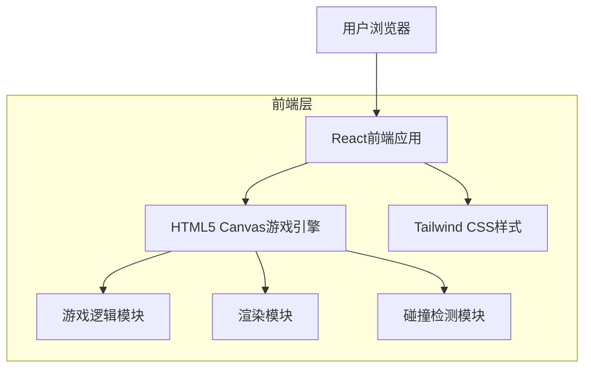
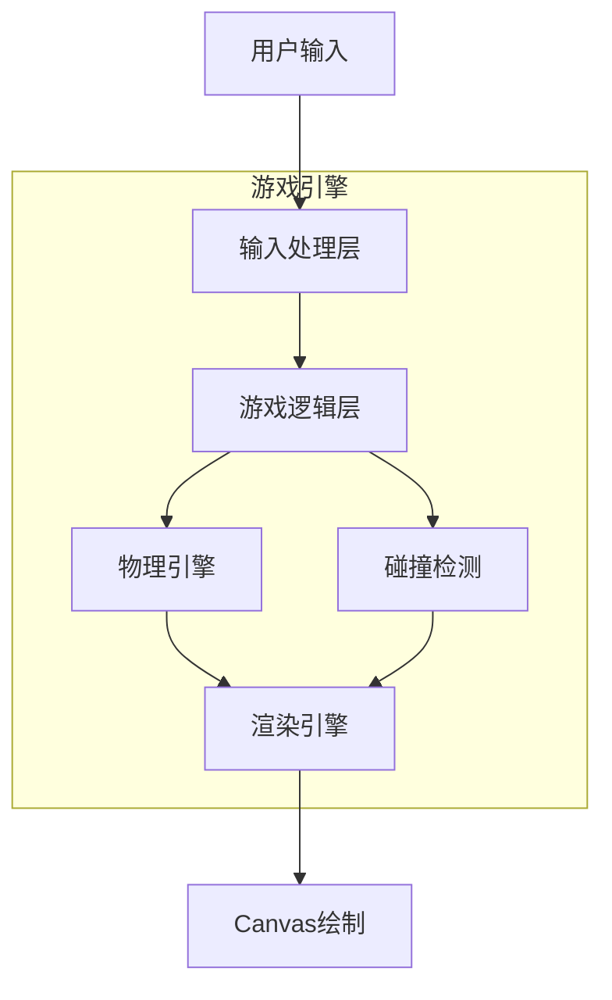
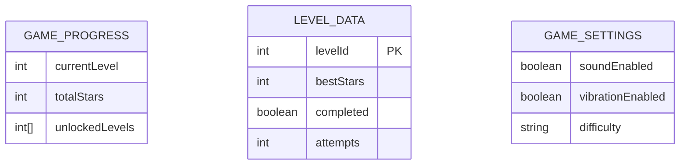

## 1. 架构设计



## 2. 技术描述

- **前端**: React@18 + TypeScript + Vite + Tailwind CSS
- **初始化工具**: vite-init
- **游戏渲染**: HTML5 Canvas
- **动画**: requestAnimationFrame + CSS3动画
- **状态管理**: React Hooks (useState, useEffect, useRef)
- **后端**: 无（单机游戏，本地存储进度）

## 3. 路由定义

| 路由 | 用途 |
|-------|---------|
| / | 主页面，显示游戏标题和开始按钮 |
| /levels | 关卡选择页面，显示关卡网格 |
| /game/:levelId | 游戏页面，进行具体关卡游戏 |
| /result/:status | 游戏结果页面，显示成功或失败 |

## 4. 核心组件结构

### 4.1 游戏引擎组件
```typescript
interface GameEngineProps {
  levelId: number;
  onGameComplete: (stars: number) => void;
  onGameFail: () => void;
}

interface GameState {
  sunflowerRotation: number;
  rotationSpeed: number;
  projectiles: Projectile[];
  remainingAmmo: number;
  targetCount: number;
  currentStars: number;
  isPaused: boolean;
}

interface Projectile {
  id: string;
  angle: number;
  distance: number;
  isStuck: boolean;
}
```

### 4.2 关卡配置
```typescript
interface LevelConfig {
  id: number;
  name: string;
  difficulty: 'easy' | 'normal' | 'hard';
  targetProjectiles: number;
  initialAmmo: number;
  rotationSpeed: number;
  rotationDirection: 'clockwise' | 'counterclockwise';
  speedVariation: boolean;
  unlocked: boolean;
  bestStars: number;
}
```

## 5. 游戏架构图



## 6. 本地数据存储

### 6.1 数据模型定义


### 6.2 本地存储实现
使用localStorage存储游戏进度和设置：

```typescript
// 游戏进度存储
interface GameProgress {
  currentLevel: number;
  totalStars: number;
  unlockedLevels: number[];
  levelData: Record<number, LevelData>;
}

interface LevelData {
  bestStars: number;
  completed: boolean;
  attempts: number;
}

// 设置存储
interface GameSettings {
  soundEnabled: boolean;
  vibrationEnabled: boolean;
  difficulty: 'easy' | 'normal' | 'hard';
}
```

### 6.3 存储键值定义
```typescript
const STORAGE_KEYS = {
  GAME_PROGRESS: 'crazy_pigeon_progress',
  GAME_SETTINGS: 'crazy_pigeon_settings',
  LEVEL_PREFIX: 'crazy_pigeon_level_'
} as const;
```

## 7. 游戏核心算法

### 7.1 碰撞检测算法
```typescript
function checkCollision(
  newProjectile: Projectile,
  existingProjectiles: Projectile[]
): boolean {
  const minAngleDiff = 15; // 最小角度差（度）
  
  return existingProjectiles.some(projectile => {
    const angleDiff = Math.abs(newProjectile.angle - projectile.angle);
    return angleDiff < minAngleDiff;
  });
}
```

### 7.2 旋转动画算法
```typescript
function updateRotation(
  currentRotation: number,
  speed: number,
  deltaTime: number,
  direction: number
): number {
  return currentRotation + (speed * deltaTime * direction);
}
```

## 8. 性能优化策略

- **Canvas优化**: 使用离屏canvas进行复杂绘制，减少重绘区域
- **动画优化**: 使用requestAnimationFrame，避免setInterval/setTimeout
- **内存管理**: 及时清理不再使用的对象引用，避免内存泄漏
- **触摸优化**: 使用passive事件监听器，提升滚动性能
- **资源加载**: 预加载游戏资源，使用雪碧图减少HTTP请求