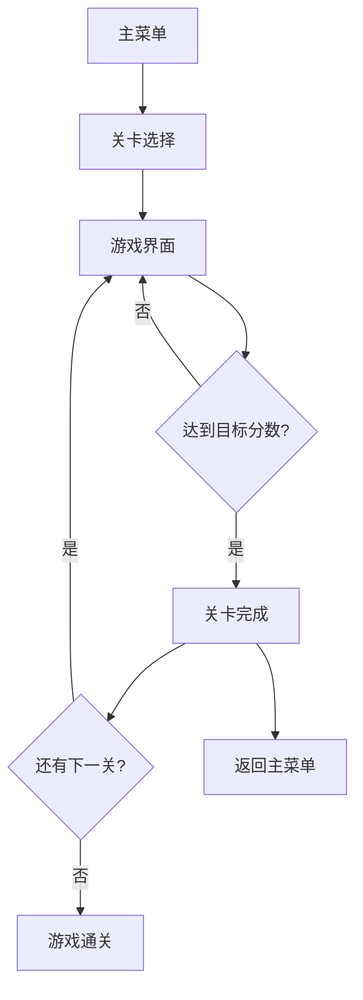

## 1. 产品概述
"疯狂的鸽子"是一款基于React+Canvas的休闲射击游戏。玩家控制可爱的鸽子角色，向旋转的向日葵发射瓜子，同时需要避开危险的虫子。

游戏包含24个精心设计的关卡，难度递增，配备连击系统、三星评价机制和华丽的粒子特效，为玩家提供轻松有趣的游戏体验。目标用户为喜欢休闲游戏的各年龄段玩家，特别适合在碎片时间娱乐放松。

## 2. 核心功能

### 2.1 用户角色
本游戏为单人休闲游戏，无需用户注册系统。玩家以访客身份直接开始游戏，游戏进度本地保存。

### 2.2 功能模块
游戏包含以下核心页面：
1. **主菜单页面**：游戏标题、开始游戏、关卡选择、设置选项
2. **游戏主页面**：游戏画布、鸽子控制、向日葵旋转、瓜子射击、虫子移动、分数显示
3. **关卡完成页面**：星级评价、分数统计、连击奖励、下一关按钮

### 2.3 页面详情
| 页面名称 | 模块名称 | 功能描述 |
|-----------|-------------|-------------|
| 主菜单页面 | 游戏标题 | 显示"疯狂的鸽子"游戏标题和logo动画 |
| 主菜单页面 | 开始游戏 | 点击开始新游戏或继续上次进度 |
| 主菜单页面 | 关卡选择 | 显示24个关卡，已解锁关卡可点击进入 |
| 主菜单页面 | 设置选项 | 音效开关、背景音乐音量调节 |
| 游戏主页面 | 游戏画布 | Canvas渲染区域，800x600像素 |
| 游戏主页面 | 鸽子控制 | 鼠标点击发射瓜子，连续点击实现连击 |
| 游戏主页面 | 向日葵旋转 | 中心向日葵持续旋转，不同关卡转速不同 |
| 游戏主页面 | 瓜子射击 | 瓜子从鸽子位置飞向点击方向，具有抛物线轨迹 |
| 游戏主页面 | 虫子移动 | 随机生成移动虫子，碰撞会减少生命值 |
| 游戏主页面 | 分数显示 | 实时显示当前分数、连击数、剩余生命值 |
| 游戏主页面 | 粒子特效 | 击中向日葵时产生粒子爆炸效果 |
| 关卡完成页面 | 星级评价 | 根据得分评定1-3星，显示星级图标 |
| 关卡完成页面 | 分数统计 | 显示本关得分、最高连击、用时统计 |
| 关卡完成页面 | 连击奖励 | 显示连击加成分数和额外奖励 |
| 关卡完成页面 | 下一关按钮 | 解锁下一关或返回主菜单 |

## 3. 核心流程
玩家进入游戏后，首先看到主菜单页面。可以选择开始新游戏或继续之前的进度。进入关卡后，玩家控制鸽子发射瓜子击中旋转的向日葵获得分数，同时要避开随机出现的虫子。每个关卡有目标分数，达到目标分数即可过关并获得星级评价。游戏支持连击系统，连续命中会获得额外分数加成。

## 4. 用户界面设计

### 4.1 设计风格
- **主色调**：明亮的黄色和绿色，营造向日葵田园风格
- **按钮样式**：圆角矩形，3D凸起效果，悬停时有缩放动画
- **字体选择**：圆润的无衬线字体，主标题48px，正文24px
- **布局风格**：居中对齐，卡片式分组，重要元素使用阴影效果
- **图标风格**：扁平化设计风格，使用emoji和简单几何图形

### 4.2 页面设计概述
| 页面名称 | 模块名称 | UI元素 |
|-----------|-------------|-------------|
| 主菜单页面 | 游戏标题 | 中央位置，大字体标题配合鸽子动画，背景为渐变天空 |
| 主菜单页面 | 开始按钮 | 绿色大按钮，带有开始图标，点击波纹效果 |
| 主菜单页面 | 关卡网格 | 6x4网格布局，显示24个关卡，锁定关卡显示灰色锁图标 |
| 游戏主页面 | 游戏画布 | 深色边框，顶部显示分数条，底部显示生命值 |
| 游戏主页面 | 鸽子位置 | 左下角固定位置，点击时产生发射动画 |
| 游戏主页面 | 向日葵 | 中央位置，黄色花瓣，棕色花心，持续旋转 |
| 关卡完成页面 | 星级展示 | 三个大星星，根据评价点亮不同数量 |
| 关卡完成页面 | 统计面板 | 半透明卡片，显示详细游戏数据 |

### 4.3 响应式设计
采用桌面端优先设计，主游戏区域固定800x600像素。在移动设备上保持画布比例，周围添加适配边框。支持触摸操作，点击屏幕任意位置发射瓜子。

### 4.4 游戏场景指导
- **环境背景**：明亮的蓝天白云田园风格，营造轻松愉快的氛围
- **光照效果**：模拟阳光照射，向日葵有轻微发光效果
- **动画效果**：向日葵平滑旋转，虫子沿贝塞尔曲线移动，粒子爆炸效果
- **音效设计**：发射瓜子"嗖"声，击中向日葵"嘭"声，获得星星"叮铃"声
