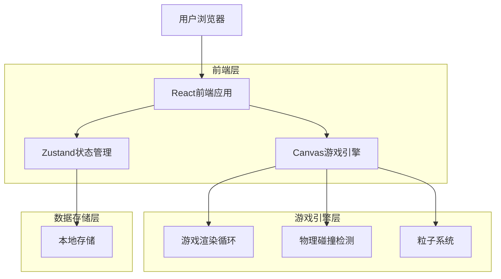
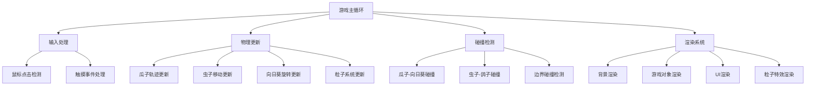

## 1. 架构设计



## 2. 技术描述

- **前端**: React@18 + TypeScript + Vite + Tailwind CSS
- **初始化工具**: vite-init
- **状态管理**: Zustand
- **游戏渲染**: Canvas API + 自定义游戏引擎
- **动画系统**: requestAnimationFrame
- **粒子系统**: 自定义Canvas粒子引擎
- **后端**: 无（纯前端游戏，数据本地存储）

## 3. 路由定义

| 路由 | 用途 |
|-------|---------|
| / | 主菜单页面，游戏入口 |
| /game | 游戏主页面，包含Canvas游戏区域 |
| /level-select | 关卡选择页面，显示24个关卡 |
| /level-complete | 关卡完成页面，显示评分和奖励 |

## 4. 核心类型定义

### 4.1 游戏对象类型

```typescript
interface GameObject {
  x: number;
  y: number;
  width: number;
  height: number;
  velocityX: number;
  velocityY: number;
}

interface Pigeon extends GameObject {
  health: number;
  maxHealth: number;
}

interface Sunflower extends GameObject {
  rotation: number;
  rotationSpeed: number;
  segments: SunflowerSegment[];
}

interface SunflowerSegment {
  angle: number;
  hit: boolean;
  points: number;
}

interface Seed extends GameObject {
  damage: number;
  isActive: boolean;
  trajectory: TrajectoryPoint[];
}

interface Bug extends GameObject {
  type: 'ladybug' | 'bee' | 'spider';
  damage: number;
  movePattern: MovePattern;
}

interface Particle {
  x: number;
  y: number;
  vx: number;
  vy: number;
  life: number;
  maxLife: number;
  color: string;
  size: number;
}

interface GameState {
  score: number;
  combo: number;
  maxCombo: number;
  level: number;
  targetScore: number;
  timeElapsed: number;
  stars: number;
}

interface LevelData {
  level: number;
  targetScore: number;
  sunflowerSpeed: number;
  bugSpawnRate: number;
  bugTypes: Bug['type'][];
  segmentPoints: number[];
}
```

### 4.2 游戏事件类型

```typescript
interface GameEvent {
  type: 'seed-fired' | 'segment-hit' | 'bug-hit' | 'combo-break' | 'level-complete';
  timestamp: number;
  data: any;
}

interface SeedFiredEvent extends GameEvent {
  type: 'seed-fired';
  data: {
    seed: Seed;
    mouseX: number;
    mouseY: number;
  };
}

interface SegmentHitEvent extends GameEvent {
  type: 'segment-hit';
  data: {
    segment: SunflowerSegment;
    points: number;
    combo: number;
  };
}
```

## 5. 游戏引擎架构



## 6. 状态管理设计

### 6.1 Zustand Store结构

```typescript
interface GameStore {
  // 游戏状态
  gameState: GameState;
  isPlaying: boolean;
  isPaused: boolean;
  
  // 关卡数据
  currentLevel: number;
  unlockedLevels: number[];
  levelData: LevelData[];
  
  // 游戏对象
  pigeon: Pigeon;
  sunflower: Sunflower;
  seeds: Seed[];
  bugs: Bug[];
  particles: Particle[];
  
  // 动作
  startGame: (level: number) => void;
  pauseGame: () => void;
  resumeGame: () => void;
  endGame: () => void;
  
  // 游戏逻辑
  fireSeed: (targetX: number, targetY: number) => void;
  updateGame: (deltaTime: number) => void;
  hitSegment: (segmentIndex: number) => void;
  hitByBug: (bug: Bug) => void;
  
  // 持久化
  saveProgress: () => void;
  loadProgress: () => void;
}
```

### 6.2 本地存储结构

```typescript
interface SaveData {
  version: string;
  timestamp: number;
  unlockedLevels: number[];
  levelStars: { [level: number]: number };
  levelHighScores: { [level: number]: number };
  settings: {
    soundEnabled: boolean;
    musicVolume: number;
    particlesEnabled: boolean;
  };
}
```

## 7. Canvas渲染优化

### 7.1 分层渲染
- **背景层**: 静态背景，偶尔更新
- **游戏对象层**: 动态游戏对象，每帧更新
- **特效层**: 粒子特效，半透明混合
- **UI层**: 分数、生命值等界面元素

### 7.2 性能优化策略
- 对象池管理：重用瓜子、虫子、粒子对象
- 空间分区：碰撞检测使用网格分区
- 脏矩形渲染：只重绘变化区域
- 帧率控制：保持稳定的60FPS

## 8. 粒子系统设计

### 8.1 粒子发射器
```typescript
interface ParticleEmitter {
  x: number;
  y: number;
  emissionRate: number;
  particleLifetime: number;
  particleSpeed: number;
  particleSize: number;
  colors: string[];
  emissionAngle: number;
  emissionSpread: number;
}
```

### 8.2 粒子效果类型
- **击中效果**: 向日葵被击中时的爆炸粒子
- **连击效果**: 高连击时的光环粒子
- **失败效果**: 被虫子击中时的警示粒子
